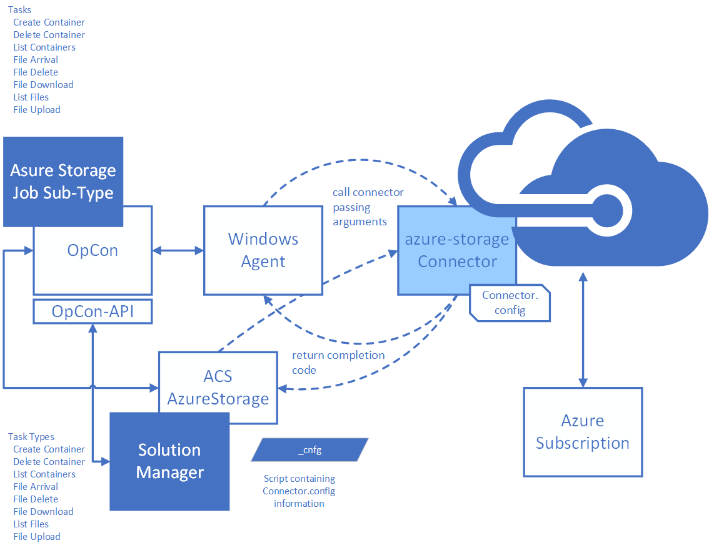

# Azure-Storage Connector

Azure Storage is an OpCon Connector for Windows that uses the Azure Java SDK to interact with Azure storage. 
Provides tasks to manage containers and blobs (files).

- **list**              Provides list of containers and blobs.    
- **container create**  Create a container.
- **container delete**  Delete a container.
- **delete file**       Delete a file (blob) within a container.
- **download file**     Download a file (blob) from a container.
- **upload file**       Upload a file to a container.
- **file arrival**      Wait for a file (blob) to arrive in a container.

