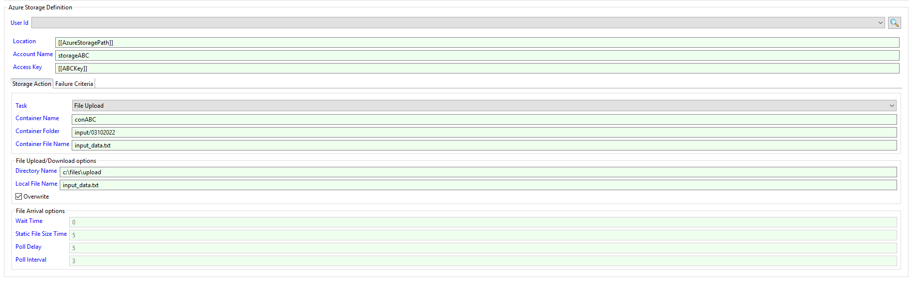

# Operation

The connector can be used by entering arguments on the command line or using the job sub-type.

## AzureStorage Job Sub-Type
The AzureStorage connector provides a Job Sub-Type that can be used to simplify job definitions within OpCon.



When using the Job Sub-Type, fill in the Account name and the Access Key associated with the Storage Account. The key value is the Connection String value that can be found in the Access keys section of the storage account (encrypted global property should be used to store the access key).

Select the Task from the drop-down list and enter the required values. Only values associated with the task will be enabled. Once a task has been saved, the task type cannot be changed.
When uploading or downloading files and specific source and target filenames are entered, wild cards are not supported.

When using the List commands a value must be specified and an (*) will display all containers and and all.

## AzureStorage Arguments
The AzureStorage connector requires arguments to be given to function. It uses the principle of Tasks, where each task performs an action or a combination of actions against Azure Storage.

### Global
Arguments | Description
--------- | -----------
**-sa**  | (Mandatory) The name of the Azure Storage account to perform the task on.
**-t**   | (Mandatory) The task to perform.
**-k**   | (Mandatory) The Access Key associated with the Storage . he key value is the Connection String value that can be found in the Access keys section of the storage account.

### containercreate
Can be used to create a new container within the storage account.

Arguments | Description
--------- | -----------
**-t**  | Value is **containercreate**
**-cn** | Required field for containercreate and consists of the name of the container to create.

Usage
```
AzureStorage.exe -sa MY_ACCOUNT -t containercreate -cn MY_CONTAINER
```
### containerdelete
Can be used to delete containers within the storage account.

Arguments | Description
--------- | -----------
**-t**  | Value is **containerdelete**
**-cn** | Required field for containerdelete and consists of the name of the container to create. Supports wild cards (? and *).

Usage
```
AzureStorage.exe -sa MY_ACCOUNT -t containerdelete -cn MY_CONT????ER
```
### containerlist
Can be used to list container within the storage account.

Arguments | Description
--------- | -----------
**-t**  | Value is **containerlist**
**-cn** | Required field for containerlist and consists of the name of the container to list. Supports wild cards (? and *).

Usage
```
AzureStorage.exe -sa MY_ACCOUNT -t containerdelete -cn *
```
### filearrival
Can be used to monitor for the arrival of a file in a specific container. It should be noted that before starting the task, any previous
existing versions of the file must be removed from the container.
Wild cards are not supported for this function.

Arguments | Description
--------- | -----------
**-t**  | Value is **filearrival**
**-cn** | Required field for filearrival and consists of the name of the container that the file will be placed in.
**-cp** | Optional field for filearrival and consists of the folder where the file will be placed in within the container.
**-cf** | Required field for filearrival and consists of the name of the file.
**-wt** | Required field for filearrival and consists of the maximum time in minutes to wait for the file. A value of 0 will wait indefinitely for the file to arrive.
**-fs** | Required field for filearrival and consists of the time in seconds for the file size to be static to determine if the file aarival is complete. Default value is 5 seconds.
**-pd** | Required field for filearrival and consists of the time in seconds to wait before the initial check. Default value is 5.
**-pi** | Required field for filearrival and consists of the time in seconds between checks. Default value is 3. 

Usage
```
AzureStorage.exe -sa MY_ACCOUNT -t filearrival -cn MY_CONTAINER -cp test/new -cf MY_FILE -wt 15 -fs 5 -pd 3 -pi 2
```
### filedelete
Can be used to delete files within containers within the storage account.

Arguments | Description
--------- | -----------
**-t**  | Value is **filedelete**
**-cn** | Required field for filedelete and consists of the name of the container to delete files from. Supports wild cards (? and *).
**-cp** | Optional field for filedelete and consists of the folder where the file resides within the container.
**-cf** | Required field for filedelete and consists of the name of the file to delete. Supports wild cards (? and *).

Usage
```
AzureStorage.exe -sa MY_ACCOUNT -t filedelete -cp test/files -cn * -cf MY_FILE???
```
### filedownload
Can be used to download files from a container within the storage account. The files are downloaded to locations relative to the azure-storage connector installation. 
Before downloading files, the files must not exist in the target directory. When container and local filename definitions are provided, wild cards are not supported. 

Arguments | Description
--------- | -----------
**-t**  | Value is **filedownload**
**-cn** | Required field for filedownload and consists of the name of the container to download files from. 
**-cp** | Optional field for filedownload and consists of the folder where the file(s) resides within the container.
**-fn** | Required field for filedownload and consists of the name of the file(s) to download. Supports wild cards (? and *).
**-di** | Required field for filedownload and consists of the full path of the directory to download the files to.
**-lf** | Optional field for filedownload and consists of the name of the target file. When this option is used, wild cards are not supported.

Usage
```
AzureStorage.exe -sa MY_ACCOUNT -t filedownload -cn MY_CONTAINER -cn MY_FILE??? -di c:\DOWNLOAD\MY_DIRECTORY
AzureStorage.exe -sa MY_ACCOUNT -t filedownload -cn MY_CONTAINER -cp test -cf MY_FILE??? -di c:\DOWNLOAD\MY_DIRECTORY
AzureStorage.exe -sa MY_ACCOUNT -t filedownload -cn MY_CONTAINER -cp test -cf MY_FILE.dat -di c:\DOWNLOAD\MY_DIRECTORY -lf MYFILE.dat
```
### filelist
Can be used to list files within containers within the storage account.

Arguments | Description
--------- | -----------
**-t**  | Value is **filelist**
**-cn** | Required field for filelist and consists of the name of the container to list files from. Supports wild cards (? and *).
**-cp** | Optional field for filedownload and consists of the folder to check for files within the container.
**-fn** | Required field for filelist and consists of the name of the file to list. Supports wild cards (? and *).

Usage
```
AzureStorage.exe -sa MY_ACCOUNT -t filelist -cn * -fn *
AzureStorage.exe -sa MY_ACCOUNT -t filelist -cn MY_CONTAINER -cp test\new -fn *
```
### fileupload
Can be used to upload files from a directory to a container within the storage account. The files are uploaded from locations relative to the azure-storage connector installation. 
Before downloading files, the files must not exist in the target directory. When container and local filename definitions are provided, wild cards are not supported.

Arguments | Description
--------- | -----------
**-t**  | Value is **fileupload**
**-cn** | Required field for fileupload and consists of the name of the container to upload files to. 
**-cp** | Optional field for fileupload and consists of the folder where the file(s) will be placed within the container.
**-cf** | Optional field for fileupload and consists of the name of the target file. When this option is used, wild cards are not supported.
**-di** | Required field for fileupload and consists of the full path of the directory to upload the files from.
**-lf** | Required field for fileupload and consists of the name of the file(s) to upload. 
**-ov** | Optional field for fileupload and indicates if existing files can be overwritten.

Usage
```
AzureStorage.exe -sa MY_ACCOUNT -t fileupload -k [[access_key]] -cn MY_CONTAINER -cp test -lf MY_FILE??? -di c:\UPOAD\MY_DIRECTORY -ov
AzureStorage.exe -sa MY_ACCOUNT -t fileupload -k [[access_key]] -cn MY_CONTAINER -lf MY_FILE??? -di c:\UPOAD\MY_DIRECTORY -cp test/new -ov
```
## Exit Codes
The `AzureStorage` exits `0` when the performed request succeeds. Otherwise `AzureStorage` exits `1` on failure.
